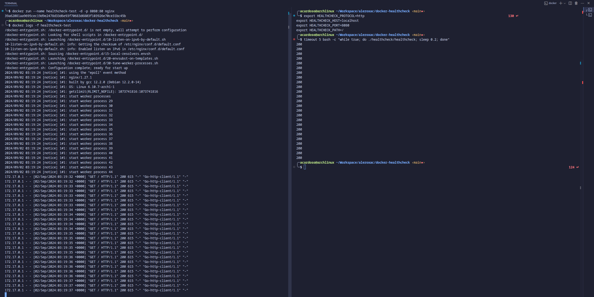
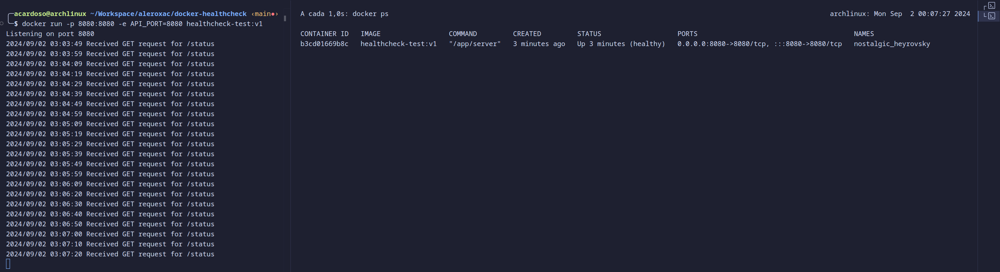

# docker-healthcheck
A simple healthcheck file to be used on docker images


## Use modes
### run locally
``` shell
docker run --name healthcheck-test -d -p 8080:80 nginx

export HEALTHCHECK_PROTOCOL=http
export HEALTHCHECK_HOST=localhost
export HEALTHCHECK_PORT=8080
export HEALTHCHECK_PATH=/

go build -o healthcheck cmd/healthcheck/main.go
timeout 5 bash -c "while true; do ./healthcheck; sleep 0.2; done"

docker rm -f healthcheck-test
```


### run via docker
``` shell
cd examples/client_http
docker build \
    --build-arg="HEALTHCHECK_PROTOCOL=http" \
    --build-arg="HEALTHCHECK_HOST=localhost" \
    --build-arg="HEALTHCHECK_PORT=8080" \
    --build-arg="HEALTHCHECK_PATH=/status" \
    --build-arg="API_PORT=8080" \
    -t healthcheck-test:v1 .

docker run --name healthcheck-test -d -p 8081:80 nginx
docker run -p 8080:8080 -e API_PORT=8080 healthcheck-test:v1
docker rm -f healthcheck-test
```

